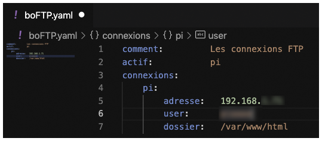
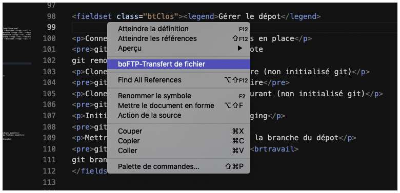
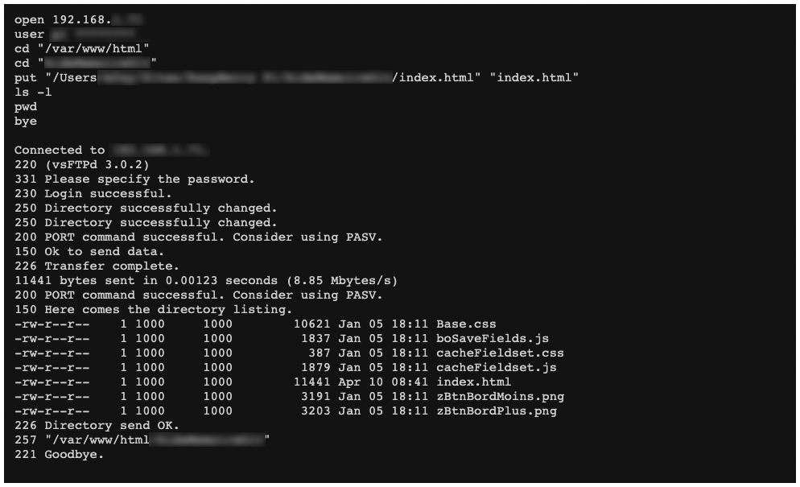

# boFTP - Le transfert de fichier via FTP.

boFTP, une solution pour transférer un fichier sur un site.    
Le paramétrage étant dans un fichier YAML à la racine (ou la racine en dessous du dépot). 
Et ce paramètre unique permet de faire des transferts FTP pour tous les sous-repertoires.

C'est seulement une possibilité de transfert de fichier texte. Pas de création de répertoire, les nouveaux repertoires seront à créer avec un autre logiciel FTP (FileZilla, Cyberduck, ...).

Une commande pour valider la connexion : `Ctrl` + `shift` + `p` : `boFTP-Validation accès FTP`    
Une commande pour faire le transfert : `Ctrl` + `shift` + `p` : `boFTP-Transfert de fichier`    
Un menu contextuel permet aussi le transfert : `boFTP-Transfert de fichier`


Exemple de contenu du fichier de paramétrage : `boFTP.yaml` :     
Ici deux connexions possibles `connex1` et `connex2`, et on choisit par le champ `actif`.     
Au premier lancement, il vous demandera le `mot de passe` du compte actif, ce mot de passe sera stocké dans un fichier : `boFTP.password`.

```
comment:         Les connexions FTP
actif:           connex1
connexions:
    connex1:
      adresse:   192.168.1.1
      user:      borakLeRouge
      dossier:   /var/www
    connex2:
      adresse:   192.168.1.1
      user:      MarcellusWallace
      dossier:   /var/www
```

Dans le fichier `.gitignore`, il sera utile d'ignorer les fichiers `boFTP.*`.

Une option de l'extension permet de récupérer le compte-rendu de l'extension lors du transfert (comme pour la vérification ce qui s'effectue automatiquement). Ca peut être utile, mais c'est un peu encombrant. 

----

## Contraintes

Attention, BoFTP pilote le client FTP en ligne de commande. Si un client FTP n'est pas installé sur votre système, boFTP ne pourra pas marcher. Dans ce cas, il vous faudra installer le client FTP sur votre ordinateur (ce que j'ai fait pour mon Macintosh, car ce n'est plus le cas sur certains systèmes récents).

----

## Images exemples

Le fichier paramètre :



Le menu de transfert :

 

Le compte-rendu de transfert (optionnel) :

 

----

## Release Notes

### 0.1.3

Quelques photos d'écran dans le ReadMe.

### 0.1.2

Amélioration du ReadMe.

### 0.1.*

Première version fonctionnelle avec ses retouches.

### 0.0.4

Gestion du mot de passe.

### 0.0.3

YAML multicible.

### 0.0.2

Première version fonctionnelle.

### 0.0.1

Initialisation du projet.

